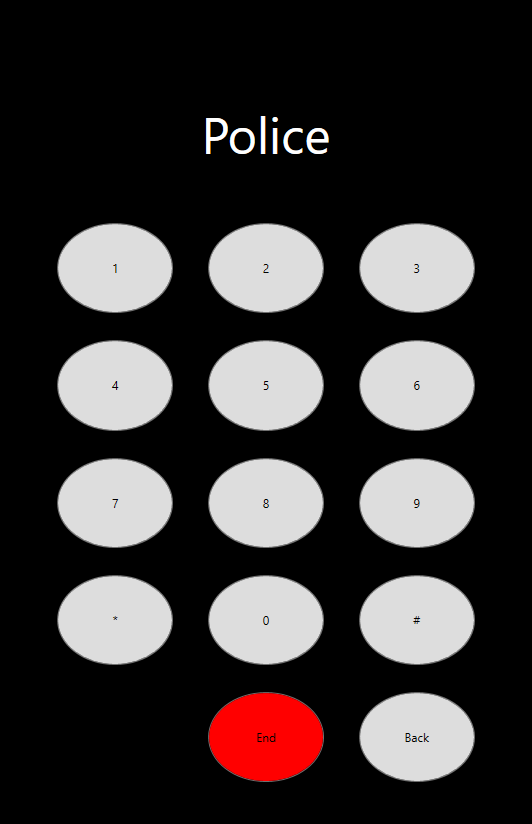

# Voicemail Application

This application allows the user to dial a number and emulate a call. If the number does not match a number saved in the contact list, the call will fail stating the number is not in service. If the number does match a contact number, the call will be successful emulating a ringing noise and playing the voicemail associated with that contact. 

There are 3 screens associated with this application: the Contacts Screen, Keypad Screen, and Call History Screen. 

## Contacts Screen

This screen contains a list of the saved contacts within the application. Each contact will display the contact name, number, and a call button that can be pressed to instantly dial the number for that contact.

## Keypad Screen

This screen allows you to dial any number and initiate a call. Only numbers matching a contact number will play a voicemail. While typing, the phone number will be displayed. Once the call button is pressed, if the number matches a contact, the contact name will be displayed.

## Call History Screen

This screen contains a list of the previous calls made while using the application. Each listing will display the Contact Name, number, and time the call was made.
